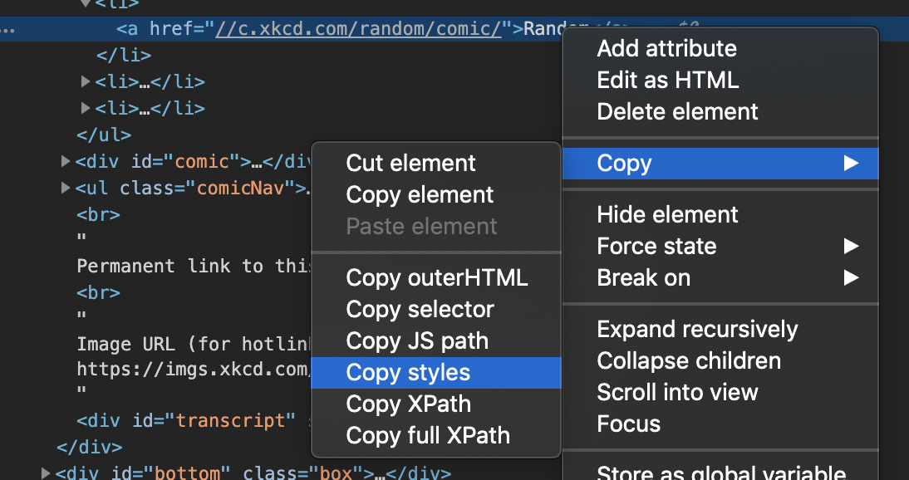

How much times have you seen nice button on page but found it so frustrating to copy its styles due to zillion selectors? Well, Chrome has got you covered!

> Note that as of August of 2019 this feature is available only in [Chrome Canary](https://www.google.com/chrome/canary/) but should be released in stable version soon.

It is pretty straightforward. Just open Chrome Dev Tools and select an element with selection tool.

After that all you need to do is right click on an element > Copy > Copy Styles.

And that's it! Styles are copied to your clipboard and ready to use.

Really simple and useful trick everyone should know!
