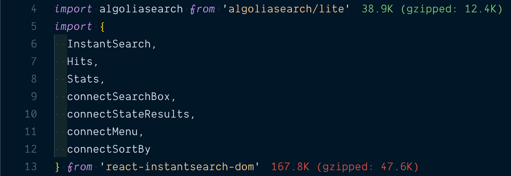
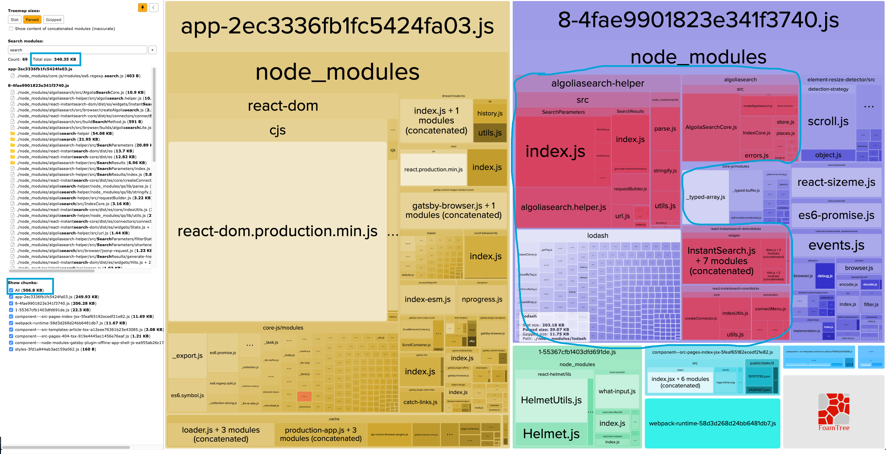

I've recently written about [adding Algolia search to Gatsby site](https://bartol.dev/a-complete-guide-to-get-algolia-search-on-your-gatsby-site/) and while [Algolia](https://www.algolia.com/) is awesome, I've found some problems that were deal breakers for me (and might for you). So I want to share them with you today.

## Bundle size

Bundle size of Algolia React InstantSearch is absolutely massive. I have even written [GitHub issue about it](https://github.com/algolia/react-instantsearch/issues/2810) recently. It has some improvements in version 6, which is now in beta, but it's still too much in my opinion. Here is its bundle size as of September 2019.

While it might not seem _too much_ at the first glance, that is bundle of this blog (with Algolia) and as you can see there isn't much going on here but bundle is half of megabyte.

## Offline search

Algolia search sends requests to Algolia server on every keystroke to receive results, and while it's impressively fast, it can't work offline. Or at least I can't find how to make it work offline. Pretty sure it can't do that.

## Alternative

Enter [fuse.js](https://fusejs.io/). JavaScript fuzzy search library. While it isn't nearly as feature packed as Algolia, **it fits my needs better**. Fuse bundle size is only about 10 KB and it does all of its magic on client side (offline works out of the box). I'll make post how to integrate it on your site in next few days.

## Conclusion

While Algolia definitely has better options to customize and personalize search that comes with the price. For simple blog it's definitely unnecessary. **It all depends on your needs.**
