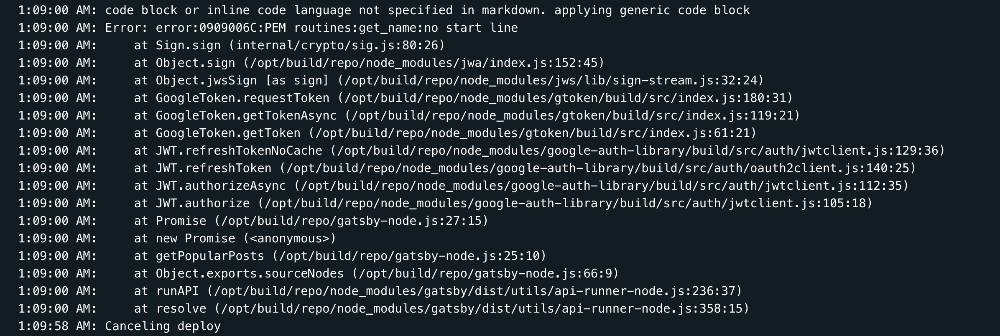

First a little bit of backstory. About one month ago I was working on fetching top posts from this blog from Google Analytics and I encountered this pretty cryptic error.



Everything was working perfectly on local environment but on Travis CI and Netlify it was failing. After reading countless Stack Overflow questions and copy-pasting my API keys multiple times I stumbled on [this](https://github.com/googleapis/google-api-nodejs-client/issues/1110#issuecomment-436868760) issue comment.

The problem was that Netlify and Travis CI were escaping `\` in newline characters so they would look like this `\\n`.

## Solution

Add this to your code.

```js
const replace = require('lodash.replace')

const apiKey = replace(process.env.YOUR_API_KEY, new RegExp('\\\\n', 'g'), '\n')
```

Make sure to install lodash replace module.

```bash
yarn add lodash.replace

# or with npm
npm i lodash.replace
```

And don't forget to use your "escaped" key instead of original one for authentication.

```js
someCoolServiceThatNeedsApiKey(
  apiKey
  // ...
)
```

## Resources

- [Github issue comment with fix](https://github.com/googleapis/google-api-nodejs-client/issues/1110#issuecomment-436868760)
