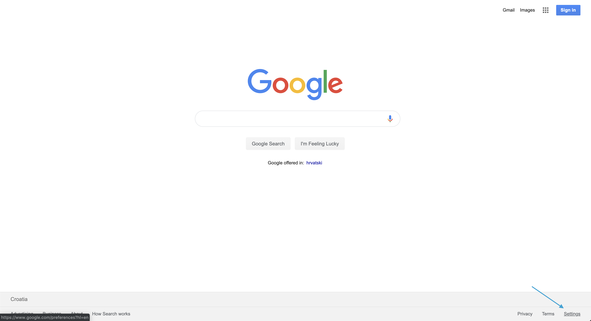
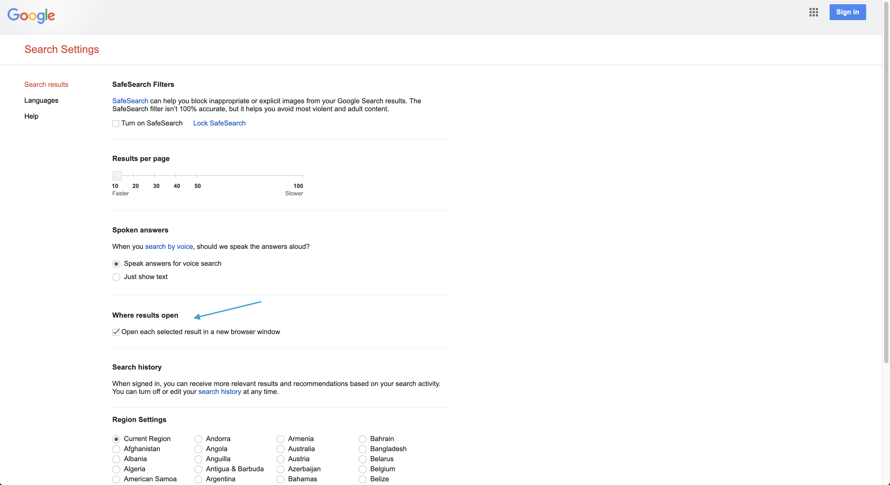

This is pretty useful feature I discovered recently. Definitely better than holding `cmd` after every search.

First thing you have to do is navigate to [google.com](http://google.com) and click `settings` in bottom right.

From pop-up menu select `Search settings` option.

And in `Search settings` check `Where results open` checkbox.

That's it. No more `cmd` on every search!
